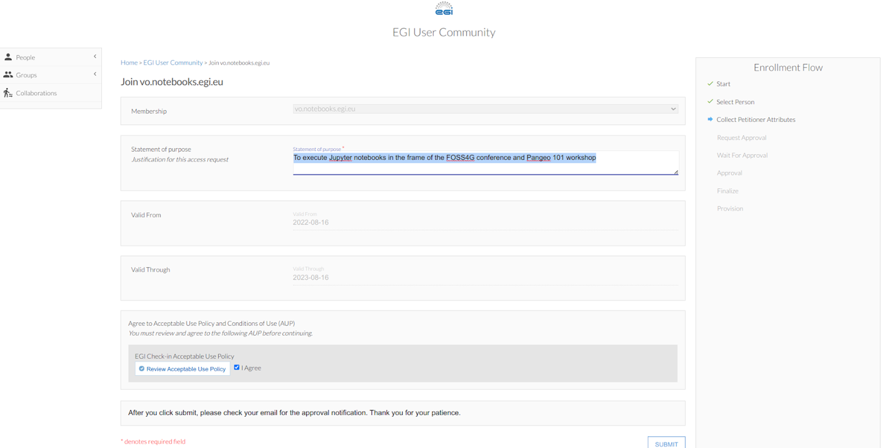

# Setup: how to run the tutorial

This tutorial's goal is to provide a wide introduction to EOSC and some core EOSC services. 

This page will describe three ways of running the tutorial:

- Through EOSC resources (recommended)
- Locally on your personal computer
- Using other available Binderhubs solutions

## Running the tutorial on the European Open Science Cloud (EOSC) 

First, before the workshop, all the participants will have to create an EGI account and enroll to the the Virtual Organisations to have access to EOSC EGI JupyterHub and/or EOSC EGI BinderHub.
There are several steps to follow:

1. Sign up for an EGI account:  [https://aai.egi.eu/signup](https://aai.egi.eu/signup). We recommend to use  your [ORCID](https://orcid.org/) account to authenticate (create an ORCID account if you do not have one yet).
2. Enroll to the **vo.notebooks.egi.eu** VO by clicking on [https://aai.egi.eu/registry/co_petitions/start/coef:111](https://aai.egi.eu/registry/co_petitions/start/coef:111). This will take you to the website shown on the Figure  and then to . For the latter e.g. when asking to join the EGI VO notebook,  in the "statement for purpose" simply write “**To execute Jupyter notebooks at the EOSC 101 workshop in the frame of the FOSS4G-2022 conference**”. Review and agree on the policy and click on “Submit”. Once your enrollment has been validated you will have access to [/https://replay.notebooks.egi.eu/](https://replay.notebooks.egi.eu/) (it requires you to authenticate using EGI Check-in credentials), a service building on BinderHub but with more compute resources than [https://mybinder.org/](https://mybinder.org/). 


:::{note}
It is **important** to perform all these steps **as early as possible** in order for managers of the Virtual Organisations to approve your petitions to join (which may **take several days**).
:::

Once your enrollments have been validated, you may need to log out from EGI Check-in to refresh your account. If you have any trouble, request help by [filling an issue](https://github.com/annefou/EOSC-Future-Training-North-Macedonia/issues/new) before the workshop. Someone will assist you with the setup.


Alternatively, you can also open notebooks one by one from the EOSC 101 section of this Jupyterbook by clicking on the rocket icon 🚀 on top of the notebook and choosing Jupyterhub option.

## Running on your own computer

Most parts of this tutorial were designed to run with limited computer resources, so it is possible to run on your laptop.
It is a bit more complicated as you will have to install the software environment yourself. Also you will not be able to test real cloud distributed processing with Dask gateway.

Steps to run this tutorial on your own computer are listed below and demonstrated _through Linux commands only_:

1. git clone this repository.
```bash
git clone https://github.com/annefou/EOSC-Future-Training-North-Macedonia.git
```
2. Install the required software environment with Conda. If you do not have Conda, install it by following these instructions (see [here](https://docs.conda.io/en/latest/miniconda.html)). Then create the environment, this can take a few minutes.
```bash
conda env create -n eosc101 -f EOSC-Future-Training-North-Macedonia/.binder/environment.yml
```
3. Launch a Jupyterlab notebook server from this environment.
```bash
conda activate eosc101
jupyter lab
```
4. Open a web browser and connect to the Jupyterlab provided URL (you should see it in the jupyter lab command outputs), something like: http://localhost:8888/lab?token=42fac6733c6854578b981bca3abf5152.
5. Navigate to EOSC-Future-Training-North-Macedonia/workshop/eosc101/ using the file browser on the left side of the Jupyterlab screen.

## Running using a Binderhub deployment

[Binderhub](https://binderhub.readthedocs.io/en/latest/) is a cloud service that allows users to share reproducible interactive computing environments from code repositories. It is generally used to enable other users to easily run your own code through Jupyter notebooks. 
It is a really cool service offered for free by several organisations (MyBinder through Jupyter, GESIS, etc.).

It is probably the easiest way to execute notebooks in this repository, as you only have to do one click to arrive in a Jupyterlab with all the necessary libraries.
However, the hardware resources of the public BinderHub are quite small, so you may have issues with parts of the notebooks will be unavailable.

All the notebooks on the EOSC 101 section have a rocket icon 🚀 at the top, from which you can select the Binder button to just run this notebook on the [EGI Binder service](https://replay.notebooks.egi.eu/).

Alternatively, you can also directly click on the below buttons:d


MyBinder:

[](https://mybinder.org/v2/gh/annefou/EOSC-Future-Training-North-Macedonia/HEAD)

You will then have to navigate to the EOSC-Future-Training-North-Macedonia/workshop/eosc101/ folder using the file browser on the left side of the Jupyterlab screen.
